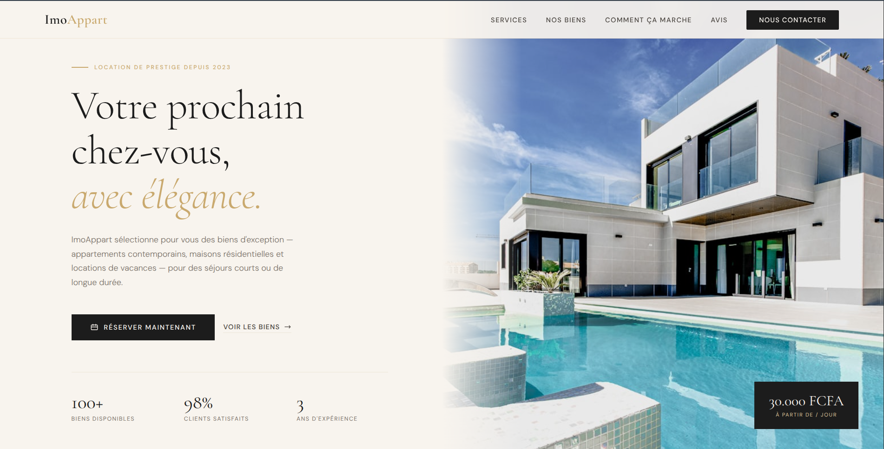

# ImmoAppart — Luxury Real Estate Rental

A **premium real estate rental website** built with HTML, CSS and JavaScript, featuring GSAP animations, scroll-triggered reveals and a fully responsive layout.

---

## Features

- Cinematic hero entrance with curtain reveal and GSAP timelines
- ScrollTrigger animations with staggered reveals on every section
- Animated statistics counters with gold flash effect
- Contact form with client-side validation and success feedback
- Full-screen mobile menu with GSAP cascade animation
- Fully responsive — mobile-first layout and non-sticky nav on mobile

---

## Technologies Used

- **HTML5** – Semantic structure for clean, accessible markup
- **CSS3** – Custom properties, CSS Grid, Flexbox and responsive breakpoints
- **JavaScript (Vanilla)** – Form validation, scroll behavior and UI interactions
- **GSAP 3.12** – Cinematic animations, ScrollTrigger and timeline sequencing
- **Google Fonts** – Cormorant Garamond (serif) + DM Sans (sans-serif)

---

## Preview

